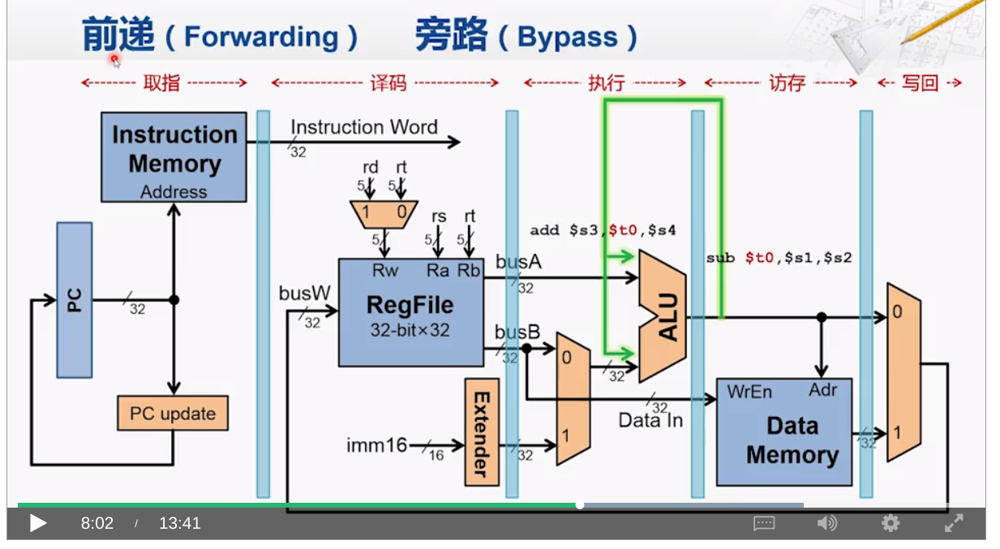
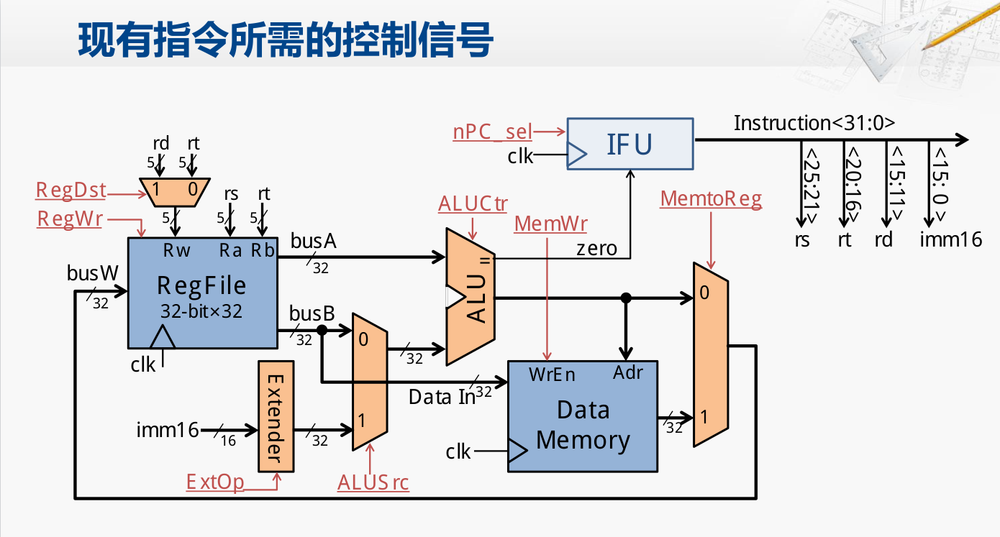

#  RISCV模拟器 #

## 编译 ##
./build
生成二进制文件在./bin/RvSim

## 运行 ##
./RvSim -memory 会在运行结束时要求输入需要打印的内存地址和打印长度

## 结果 ##
运行结果截图存储在result文件夹下

## 源代码 ##
源代码在src文件夹下

## cpu设计 ##
cpu设计为经典五级流水线：

cpu信号控制如下：

流水线划分之后流水线之间的寄存器需存的值

- IF_ID  取指-译码阶段，保存数据 inst,  保存信号 无
- ID_EX 译码-执行阶段，保存数据: 指令分析的所有结果，包括寄存器编号，可能存在的立即数，opcode和func，从寄存器取得的数据，包括rs1，rs2。保存的信号:ALUCtr，PCSel,MemRe,MemWr,Mem2Reg,REGWr
- EX_MEM 执行-访存阶段，保存数据：指令信息，ALU计算结果，寄存器值rs1，rs2。保存信号：PCSel，MemRe，MemWr，Mem2Reg,RegWr，
- MEM_WB 访存-写回：保存数据：指令信息，存储器读取值，ALU计算值，保存信号：PCSel，Mem2Reg，RegWr，

冒险控制：
数据冒险：
- 简单处理，在译码阶段检测需要使用的寄存器的值，如果正在被写入，则直接停顿，知道写入行为结束
- 复杂：在表示寄存器使用状态的数组中表示出正在执行的步骤，译码阶段可以直接去相应的步骤进行读取数据，即前递

控制冒险：
- 对于直接跳转指令，在译码阶段得到跳转地址之后直接将新的PC更新，由于模拟流水线是倒叙执行，因此会在取指阶段直接取新的地址取得指令
- 对于条件跳转，计算结果应该在执行模块之后得到，因此在执行模块结束之后，检查指令是否为条件跳转，是则根据计算结果决定是否更新PC，因此在译码阶段发现条件跳转指令后需要让IF步骤停止一个周期