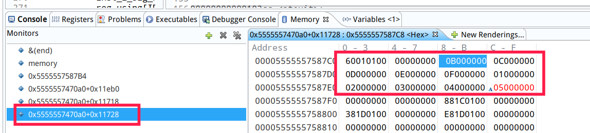
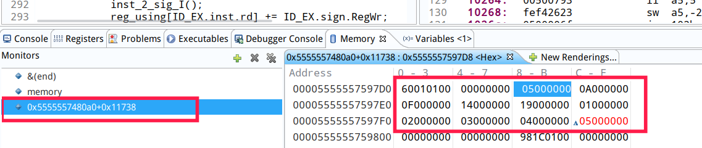
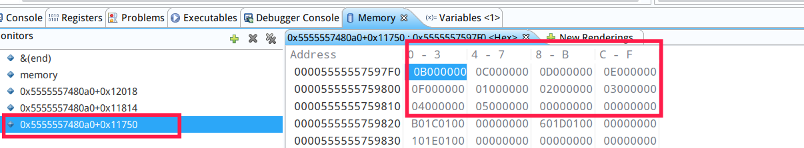
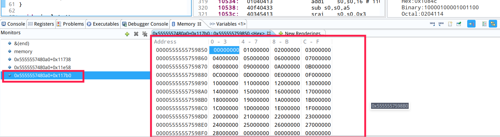
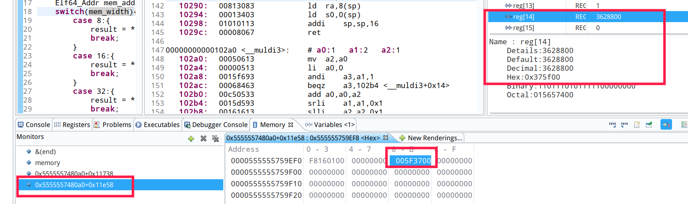

# RISC-V CPU模拟器设计与实现报告 #

## 开发环境 ##
开发在linux下进行，操作系统版本deepin 15.9.2 
编译器版本gcc version 7.3.0 (Debian 7.3.0-19)
使用语言C语言
开发软件使用eclipse cdt，支持单步可视化的调试功能和寄存器，内存的查看操作
## 设计概述 ##
主要模块分为一下几个：
- readelf模块，主要功能是将elf可执行文件读取至内存，并且分析其段信息得到程序入口地址，代码段结束地址，将上述变量保存至全局变量中，然后将elf文件映射到内存模块维护的内存数组的指定位置，并且设置内存数组基地址相对于elf文件需求的虚拟内存地址的偏移量。
- memory内存模块，维护模拟的内存数组，提供对于内存的读写接口。
- util工具模块，主要实现常用的工具函数，例如截取指定位，符号扩展，自己编写的整数指数运算（这是因为自己的linux版本不知道为什么没有pow函数。。。）
- Simulation模块，主要实现cpu的模拟，包括五级流水线的模拟，寄存器的维护。

## 具体设计实现 ##
- 可执行文件的装载、初始化和存储接口：这部分功能集中在readelf.c文件中，包括如下几个函数：
```C
void read_elf(char* path);
void load_elf_2_memory();
void print_pro_header(int i,Elf64_Phdr* pro_header);
void print_elf_header();
```
后两个print函数主要用于调试，前两个主要用于读取和装载操作，其中`read_elf(char* path)`函数首先读取elf头的信息，获得程序段的数量，大小和起始偏移，然后调用`load_elf_2_memory()`函数，该函数从二进制文件流中逐个程序段的读取，然后映射到内存`memory[]`的开始位置，并且设置`memory[0]`相对于程序入口地址的偏移量，方便两种地址之间的转换。
- 指令语义的解析和控制信号的处理：信号处理主要包含一下几个函数
```C
//根据译码结果生成ID_EX中的信号
void inst_2_sig();
//分别对四种指令类型进行 处理生成信号
void inst_2_sig_R();
void inst_2_sig_I();
void inst_2_sig_S(); //包含S和SB指令
void inst_2_sig_U();  //包含U和UJ指令
```
主要需要分析的控制信号包含如下内容：
```C
struct Sign{
	//信号信息
	unsigned ALUCtr;      //运算器操作类型，+ - ..
	unsigned MemRe,MemWr;     //内存读写控制
	unsigned MemWide;      //8 16 32 64对于内存操作的宽度
	unsigned Mem2Reg;       //1代表将内存读出数据写入寄存器堆
	unsigned RegWr;         //1代表写入寄存器堆
};
```
在指令分析的过程中，主要需要将指令分解为如下部分：
```C
struct Inst{
	unsigned opcode;
	unsigned rs1,rs2,rd;
	unsigned func3,func7;
	unsigned int imm12;
	unsigned int imm20;
	unsigned int imm7;
	unsigned int imm5;
};
```
其中指令分解的步骤在流水线ID的逻辑中处理，主要是对于32位指令的位操作：

```C
//获取执行阶段所需的全部信息
OP = ID_EX.inst.opcode = R_getbit(inst,0,6);
rs1 = ID_EX.inst.rs1 = R_getbit(inst,15,19);
rs2 = ID_EX.inst.rs2 = R_getbit(inst,20,24);
imm5 = rd = ID_EX.inst.imm5 = ID_EX.inst.rd = R_getbit(inst,7,11);
func3 = ID_EX.inst.func3 = R_getbit(inst,12,14);
imm7 = func7 = ID_EX.inst.imm7 = ID_EX.inst.func7 = R_getbit(inst,25,31);
imm12 = ID_EX.inst.imm12 = R_getbit(inst,20,31);
imm20 = ID_EX.inst.imm20 = R_getbit(inst,12,31);
```
获得相关信息后根据opcode和func3，func7的值，对应于不同指令的分析逻辑，填充流水线寄存器：
```C
struct IDEX{
	unsigned int isAbuble;  //是否是插入的流水线停顿
	int PC;
	//指令信息
	struct Inst inst;
	//寄存器数据
	REG Rs1,Rs2;
	//分析得到ALU操作数
	REG AluSrc1,AluSrc2;

	struct Sign sign;
	
}ID_EX;
```

- 系统调用和库函数接口的处理：
由于系统调用的相关操作在rv64i指令集中非常少，因此处理逻辑非常简单，单独将系统调用设定位了一种ALU运算类型，ALU根据传入的操作类型是加减乘除等等或者系统调用来判断并执行对应的系统调用操作，后续的流水线阶段不需要对该指令进行操作。
- 流水线设计：
流水线设计位经典的五级流水线，包括IF，ID，EX，MEM，WB五个阶段，每个阶段之间使用寄存器保存计算得到的值，在高级语言设计中使用时间串行的方式代替硬件中空间并行的设计，因此，在每一个周期中，执行顺序位WB，MEM，EX，ID，IF。这样可以防止流水线寄存器被淹没。
每个流水线寄存器需要保存的值不同，定义在reg_def.h文件中，结构如下：
```C
struct IFID{
	unsigned int isAbuble;  //是否是插入的流水线停顿 1则代表是停顿
	unsigned int inst;
	int PC;
}IF_ID;


struct IDEX{
	unsigned int isAbuble;  //是否是插入的流水线停顿
	int PC;
	//指令信息
	struct Inst inst;
	//寄存器数据
	REG Rs1,Rs2;
	//分析得到ALU操作数
	REG AluSrc1,AluSrc2;

	struct Sign sign;
	
}ID_EX;

struct EXMEM{

	unsigned int isAbuble;  //是否是插入的流水线停顿

	int PC;
	struct Inst inst;
	REG AluOut;
	REG Rs1,Rs2;

	struct Sign sign;

}EX_MEM;

struct MEMWB{

	unsigned int isAbuble;  //是否是插入的流水线停顿

	int PC;
	struct Inst inst;
	REG MemOut;
	REG AluOut;
	
	struct Sign sign;
}MEM_WB;
```
为了方便处理，每一个流水线寄存器都保留了完成的指令分析信息，方便对于特殊的指令进行判断。
- 冒险的处理：
对于流水线处理形式，就必然存在数据冒险和控制冒险，对于控制冒险：
	使用的前递的方式，继承了类似于IFU模块的功能，对于无条件跳转指令，其跳转地址可以根据指令直接得到，因此在译码阶段分析得到的PC新的值直接写入PC，这样在这个周期中，由于IF在ID之后执行，因此可以避免停顿直接到新的地址获得指令。实现如下：

```C
if(OP == 0x37){      
	ID_EX.AluSrc1 = 0;
}else if(OP == 0x6f){       //直接跳转指令
	ID_EX.AluSrc2 = 4;
	unsigned offset = (R_getbit(imm20,9,18) << 1) | (R_getbit(imm20,8,8) << 11);
	offset |= (R_getbit(imm20,19,19) << 20) | (R_getbit(imm20,0,7) << 12);
	offset = R_ext_signed(offset,21);
	NEW_PC = IF_ID.PC + offset;
	if(ID_EX.PC == NEW_PC)
		exit_flag = 1;
	PC = NEW_PC;
}
```

	对于条件跳转指令，其计算结果最晚在EX阶段就可以获得，因此在EX阶段加入判断逻辑，对于条件跳转指令如果判断其跳转位真则直接设置PC为新的地址，因此在上一个周期分析指令时如果发现是条件跳转指令，则会选择停顿一周期。实现如下
```C
//条件跳转语句的判断结果在这里得到，结果符合的话则直接将NewPC写入PC。
unsigned opcode = ID_EX.inst.opcode;
unsigned func = ID_EX.inst.func3;
if(opcode == 0x63){
	switch(func){
		case 0:{
			if(ALU_OUT_result == 0)
				PC = NEW_PC;
			break;
		}
		case 1:{
			if(ALU_OUT_result != 0)
				PC = NEW_PC;
			break;
		}
		case 4:
		case 6:{
			if((long long)ALU_OUT_result < 0)
				PC = NEW_PC;
			break;
		}
		case 5:
		case 7:{
			if((long long)ALU_OUT_result >= 0)
				PC = NEW_PC;
			break;
		}
	}
}
```
- 调试接口和其它接口：如果使用 -g参数运行的话，会进入调试状态，要求输入一个指定地址并且直接在该地址发生停顿。

## 实验结果 ##
对于实验结果的运行结果进行了截图，数据如下：
- add 

- mul-div

- simple-func

- qsort

- n!


## 功能性能评测 ##
总评测数据如下：

|测试用例|动态指令数|执行周期数|停顿周期数|数据冒险停顿周期数|CPI |
| --------   | --------  | --------  | -------- | -------- | -------- |
|add|424|809|386|352|1.908 |
| mul-div | 449 | 889 | 441 | 407 | 2.002 |
| simplefunc | 441 | 832 | 392 | 357 | 1.887 |
| qsort | 19034 | 38509 | 19476 | 17607 | 2.023 |
| n! | 679 | 1183 | 505 | 416 | 1.742 |

## 总结 ##
整体来说，实现的困难集中于流水线的设计上，由于使用高级语言的串行性代替了硬件的并行特点，因此对于各种信号的设置时机掌握就比较重要，在这里话费了比较大量的时间，从实验数据的总结上来看，数据冒险显然显著的降低了整体的性能，由于时间关系，对于数据冒险其实没有进行任何的处理，因此绝大部分的流水线停顿都来源于数据冒险，后续可能会再次优化。


